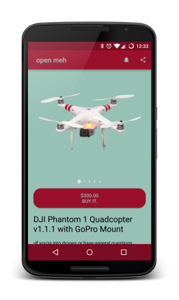

# open meh

meh.com Android app using Kotlin, Retrofit, Moshi, Coroutines, Coil, WorkManager, and more!



<a href="https://play.google.com/store/apps/details?id=com.jawnnypoo.openmeh">
  
</a>

[meh.com](https://meh.com/) is a deal of the day shopping experience filled with humorous writing and great personality. Once they opened up support for an API, an Android app was born.

## Building
You will need to generate your own API key from [meh](https://meh.com/forum/topics/meh-api) and add it to your `app/gradle.properties` file. If you want Firebase to work, you need to add the `google-service.json` file from Firebase to the `app` folder. You can also add a configuration for the keystore for a release build. All in all, your `gradle.properties` will look something like this:
```Gradle
MEH_API_KEY=api_key_here
KEYSTORE_NAME=file_name_of_keystore_if_you_care.jks
KEYSTORE_PASSWORD=keystorepasswordifyoucare
KEY_PASSWORD=keypasswordifyoucare
```
You can then generate a release build via:
```
./gradlew app:bundleRelease
```

## Contribution
Pull requests are welcomed and encouraged. If you experience any bugs, please [file an issue](https://github.com/Jawnnypoo/open-meh/issues/new)

License
=======

    Copyright 2023 John Carlson

    Licensed under the Apache License, Version 2.0 (the "License");
    you may not use this file except in compliance with the License.
    You may obtain a copy of the License at

       http://www.apache.org/licenses/LICENSE-2.0

    Unless required by applicable law or agreed to in writing, software
    distributed under the License is distributed on an "AS IS" BASIS,
    WITHOUT WARRANTIES OR CONDITIONS OF ANY KIND, either express or implied.
    See the License for the specific language governing permissions and
    limitations under the License.
